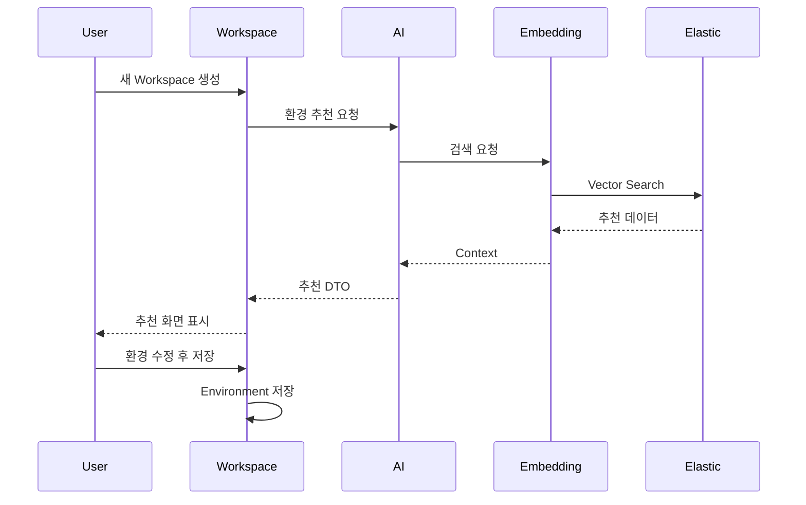

# AI Architecture

## 목적

AI는 식물에 적합한 환경을 추천한다.

---

## AI 흐름



---

## AI 특징

- RAG 기반
- Embedding Search
- Prompt Engineering
- JSON Output
- Recommendation
- AI Report

---

## AI 입력

사용자 자연어

예시

```
몬스테라 키우기 좋은 환경으로 구성해줘.
```

---

## AI 출력

```json
{
  "temperature":24,
  "humidity":65,
  "co2":700,
  "ph":6.5
}
```

저장은 하지 않는다.

Workspace가 최종 저장한다.