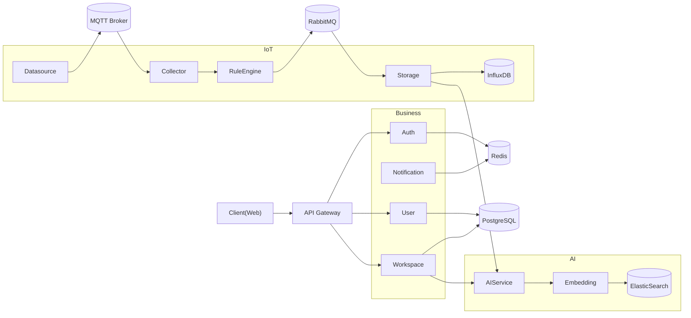

# Architecture

## 시스템 개요

EcoSphere는 IoT 센서와 AI를 이용하여 식물의 생육 환경을 관리하는 MSA 기반 플랫폼이다.

서비스는 크게 다음 네 가지 영역으로 구성된다.

- Client Layer
- Business Layer
- IoT Layer
- AI Layer

각 서비스는 독립적으로 배포 및 확장 가능하도록 설계하였다.

---

## 전체 시스템 구성

---

## 설계 목표

- 서비스 독립성
- Database Per Service
- Event Driven Architecture
- 비동기 메시징
- AI 서비스 독립
- IoT 파이프라인 독립