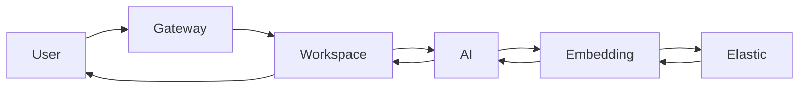
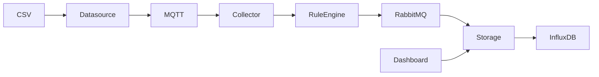
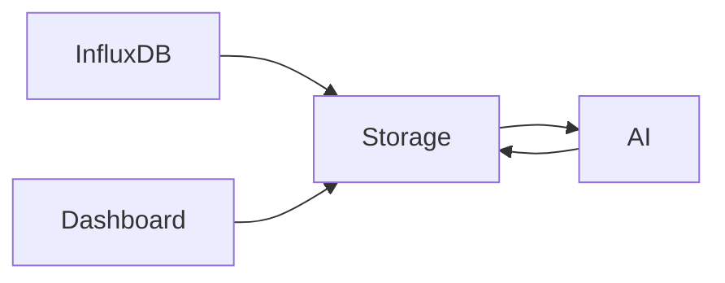

# Data Flow

## 1. AI 환경 추천



### 흐름 설명

1. 사용자가 새로운 Workspace 생성을 요청한다.
2. API Gateway는 요청을 Workspace Service로 전달한다.
3. Workspace Service는 AI Service에 식물 환경 추천을 요청한다.
4. AI Service는 Embedding Service를 통해 Elasticsearch(Vector DB)를 검색한다.
5. Embedding Service는 가장 유사한 식물 환경 정보를 반환한다.
6. AI Service는 LLM을 이용하여 추천 환경을 생성한다.
7. 추천 결과를 Workspace Service로 반환한다.
8. 사용자는 추천된 환경을 확인하고 수정한 뒤 최종 저장한다.

> **참고**
>
> AI가 생성한 추천 환경은 데이터베이스에 저장되지 않는다.  
> 사용자가 수정 후 **'환경 구성 완료'** 버튼을 눌렀을 때만 Workspace Service가 `environment_setting`을 저장한다.

---

## 2. 센서 데이터 수집 및 저장



### 흐름 설명

1. Datasource Service가 CSV 데이터를 일정 주기로 읽는다.
2. CSV 데이터를 실제 센서 데이터처럼 MQTT Broker로 Publish한다.
3. Collector Service는 MQTT Broker를 구독하여 데이터를 수신한다.
4. Rule Engine은 수신한 데이터를 분석하여 임계치 초과 여부를 판단한다.
5. 처리된 데이터를 RabbitMQ에 Publish한다.
6. Storage Service는 RabbitMQ를 Consumer로 구독한다.
7. Storage Service는 데이터를 InfluxDB에 저장한다.
8. Dashboard는 Storage Service를 통해 시계열 데이터를 조회한다.

> **참고**
>
> Rule Engine은 데이터를 저장하지 않는다.  
> Rule Engine의 역할은 **이벤트 생성 및 데이터 검증**이며, 실제 저장은 Storage Service가 담당한다.

---

## 3. AI 리포트 생성



### 흐름 설명

1. Storage Service는 스케줄러를 통해 주간 또는 월간 데이터를 집계한다.
2. 집계된 데이터를 DTO 형태로 AI Service에 전달한다.
3. AI Service는 데이터를 분석하여 자연어 리포트를 생성한다.
4. 생성된 리포트는 Storage Service를 통해 저장된다.
5. Dashboard는 Storage Service를 호출하여 AI 리포트를 조회한다.

---

## 데이터 처리 방식

| 구분 | 처리 방식 |
|------|----------|
| 사용자 로그인 | 동기(REST) |
| Workspace 생성 | 동기(REST) |
| AI 환경 추천 | 동기(REST) |
| MQTT 센서 데이터 수집 | 비동기(MQTT) |
| 센서 데이터 저장 | 비동기(RabbitMQ) |
| AI 리포트 생성 | 비동기(Scheduler) |
| 실시간 알림 | 비동기(Event) |

---

## 전체 데이터 흐름

```text
사용자
    │
    ▼
API Gateway
    │
    ▼
Workspace Service
    │
    ├──────────────► AI Service
    │                     │
    │                     ▼
    │             Embedding Service
    │                     │
    │                     ▼
    │             Elasticsearch(Vector DB)
    │
    ▼
Workspace 생성
    │
──────────────────────────────────────────────

Datasource Service
    │
    ▼
MQTT Broker
    │
    ▼
Collector Service
    │
    ▼
Rule Engine
    │
    ├────► Notification Service
    │
    ▼
RabbitMQ
    │
    ▼
Storage Service
    │
    ├────► InfluxDB
    │
    └────► AI Service (주/월간 리포트 생성)
```