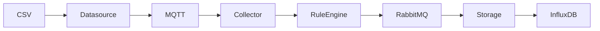

# IoT Architecture

## 데이터 흐름

---

## Datasource

개발 환경에서 실제 센서를 대신한다.

CSV를 일정 주기로 읽는다.

---

## MQTT

센서 데이터를 Publish한다.

---

## Collector

MQTT 데이터를 Subscribe한다.

---

## Rule Engine

- 임계치 검사
- 이상 이벤트 생성
- RabbitMQ Publish

---

## Storage

RabbitMQ Consumer

InfluxDB 저장

Dashboard API 제공