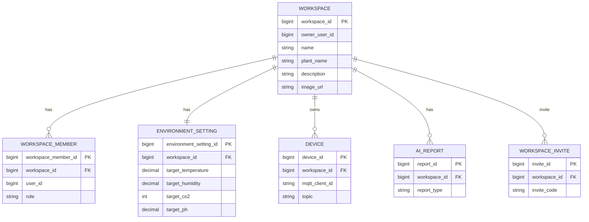

# Database ERD

## 개요

EcoSphere는 MSA(Database Per Service)를 적용하여 각 서비스가 자신의 데이터베이스만 관리한다.

사용되는 데이터베이스는 다음과 같다.

| Database | Service |
|----------|---------|
| PostgreSQL(User) | Auth, User |
| PostgreSQL(Workspace) | Workspace |
| InfluxDB | Storage |
| Elasticsearch | Embedding, AI |
| Redis | Auth, Workspace, Notification |

---

# Workspace ERD

---

# Database 역할

## PostgreSQL

비즈니스 데이터 저장

- 사용자
- Workspace
- 환경 설정
- Device
- AI Report

---

## InfluxDB

시계열 데이터 저장

- Temperature
- Humidity
- CO₂
- pH
- Device Status

---

## Elasticsearch

Vector Search

- 식물 환경 데이터
- Embedding Vector

---

## Redis

- JWT
- Refresh Token
- Dashboard Cache
- AI Cache
- Invite Cache