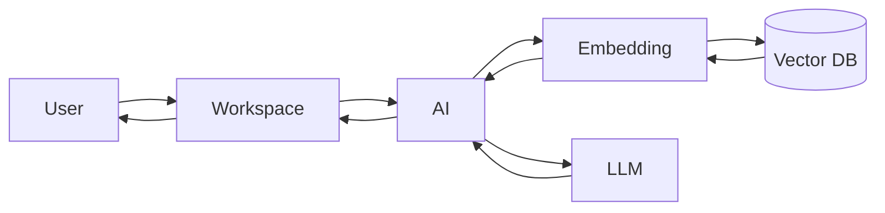

# AI Architecture

## 개요

AI Service는 사용자의 자연어 입력을 분석하여 관리 대상 식물에 적합한 생육 환경을 추천한다.

AI는 직접 데이터를 저장하지 않으며, 추천 결과만 Workspace Service에 반환한다.

Workspace Service는 사용자가 최종 수정한 환경만 데이터베이스에 저장한다.

---

## 구성 요소

- AI Service
- Embedding Service
- Elasticsearch(Vector DB)
- LLM
- Workspace Service

---

## 전체 구조

---

## 역할

### Workspace Service

- 사용자 요청 수신
- AI 추천 요청
- 추천 결과 반환
- 최종 저장

---

### AI Service

- Prompt 생성
- Embedding 검색 요청
- LLM 호출
- JSON 생성

---

### Embedding Service

- CSV Embedding
- Vector Search
- Top-K 검색

---

### Elasticsearch

- Vector 저장
- Similarity Search

---

### LLM

- Context 기반 환경 추천
- JSON 응답 생성