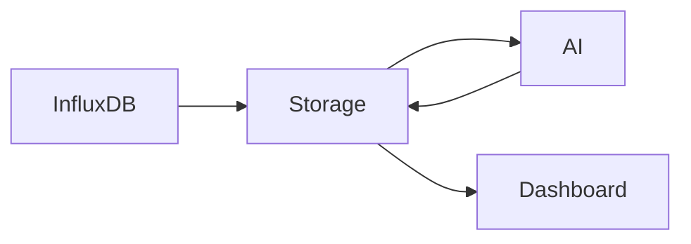

# AI Report

## 목적

주간 및 월간 데이터를 분석하여 자연어 리포트를 생성한다.

---

## 생성 과정

---

## 처리 과정

1.

Storage Service가

주간 데이터를 집계한다.

2.

DTO 생성

3.

AI Service 호출

4.

LLM 요약

5.

Storage Service 저장

---

## 예시

이번 주 평균 온도는 24.3℃였습니다.

습도는 대부분 적정 범위를 유지했습니다.

CO₂ 농도는 화요일 오후에 기준치를 초과했습니다.

전반적으로 건강한 생육 환경을 유지하였습니다.