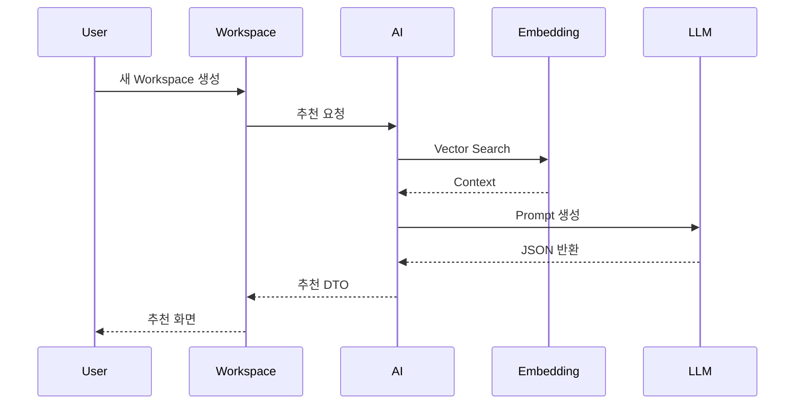

# Environment Recommendation

## 목적

사용자가 새로운 Workspace를 생성할 때 AI가 추천 환경을 생성한다.

---

## Sequence

---

## 특징

AI는 추천만 수행한다.

데이터 저장은 하지 않는다.

---

## 저장 시점

사용자가

"환경 구성 완료"

버튼을 누를 때

Workspace Service가

EnvironmentSetting을 저장한다.