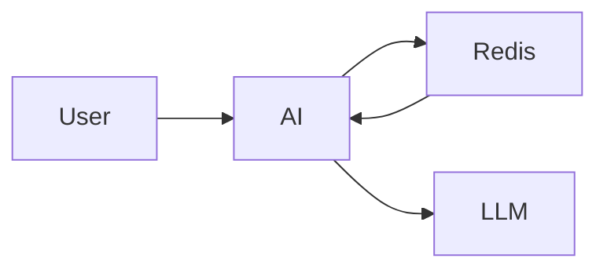

# Semantic Cache

## 목적

동일하거나 유사한 질문에 대해 LLM을 반복 호출하지 않기 위해 Redis를 이용한 Semantic Cache를 적용한다.

---

## 구조

---

## 동작 방식

1.

질문을 Embedding한다.

2.

Redis에서 유사 질문 검색

3.

존재하면 Cache 반환

4.

없으면 LLM 호출

5.

결과 저장

---

## 장점

- 응답 속도 향상
- LLM 비용 절감
- 동일 질문 품질 유지

---

## TTL

1시간

(변경 가능)