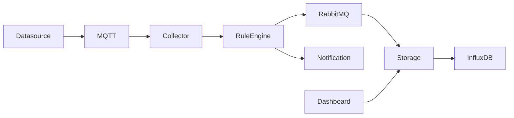

# IoT Architecture

## 개요

EcoSphere는 실제 IoT 센서를 대신하여 Datasource Service가 CSV 데이터를 일정 주기로 읽고 MQTT Broker를 통해 전송한다.

수신된 데이터는 Collector Service와 Rule Engine을 거쳐 RabbitMQ를 통해 Storage Service로 전달된다.

Storage Service는 InfluxDB에 저장하며 Dashboard에서 이를 조회한다.

---

## 전체 구조

---

## 구성 요소

- Datasource Service
- MQTT Broker
- Collector Service
- Rule Engine
- RabbitMQ
- Storage Service
- InfluxDB
- Notification Service