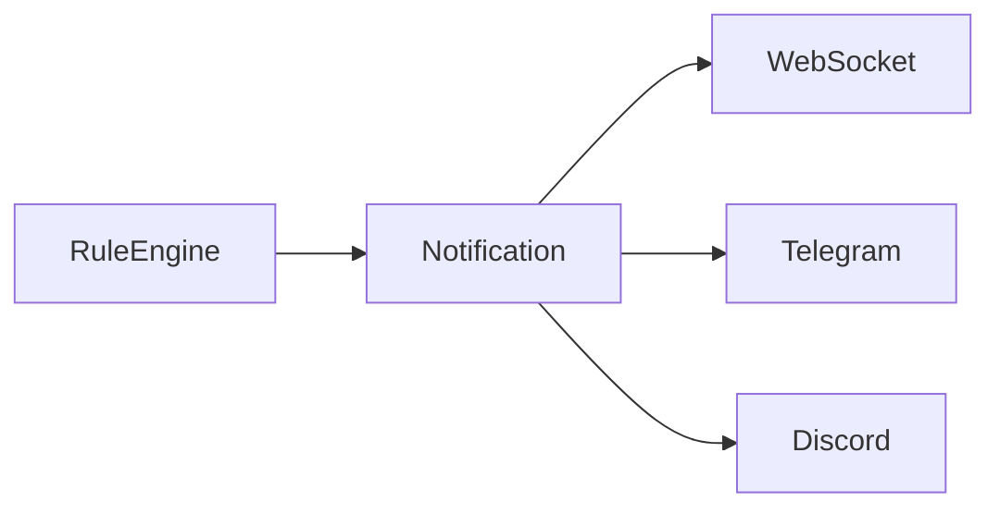

# Notification Service

## 목적

Rule Engine에서 발생한 이벤트를 사용자에게 전달한다.

---

## 지원 방식

- WebSocket
- Telegram
- Discord

---

## 처리 과정

---

## 이벤트 종류

- Temperature Alert
- Humidity Alert
- CO₂ Alert
- Device Offline
- Sensor Error