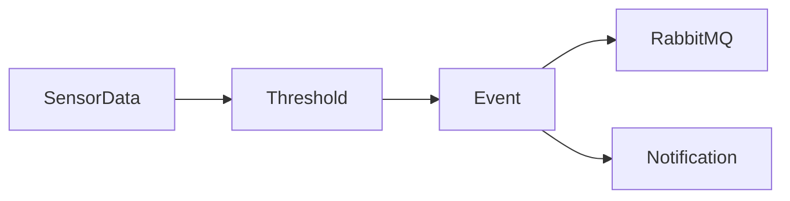

# Rule Engine

## 목적

센서 데이터를 분석하여 이상 상태를 감지한다.

---

## 역할

- 임계치 검사
- 이상 이벤트 생성
- RabbitMQ Publish
- Notification 이벤트 생성

---

## 처리 과정

---

## 검사 항목

- Temperature
- Humidity
- CO₂
- pH

---

## 예시

온도

현재

31℃

허용

20~28℃

↓

Temperature Alert