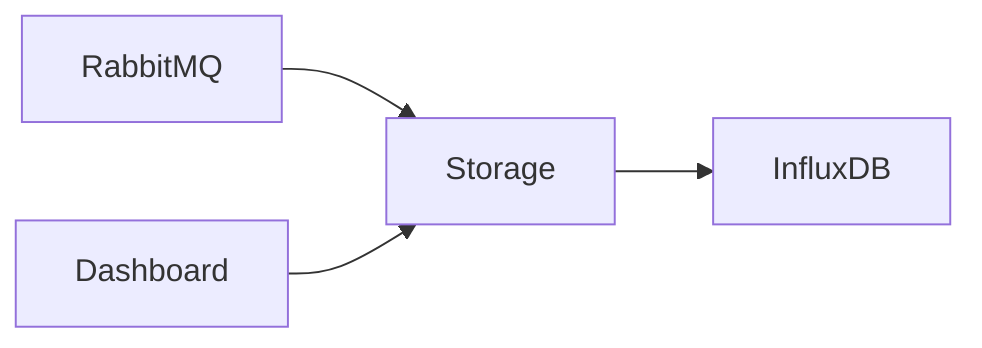

# Storage Service

## 목적

센서 데이터를 영구 저장하고 Dashboard API를 제공한다.

---

## 역할

- RabbitMQ Consumer
- InfluxDB 저장
- Dashboard 조회
- AI Report 집계

---

## 처리 과정

---

## 제공 API

- 현재 환경 조회
- 차트 조회
- 이벤트 조회
- AI Report 조회

---

## 특징

InfluxDB는 Storage Service만 접근한다.

Frontend는 InfluxDB를 직접 조회하지 않는다.